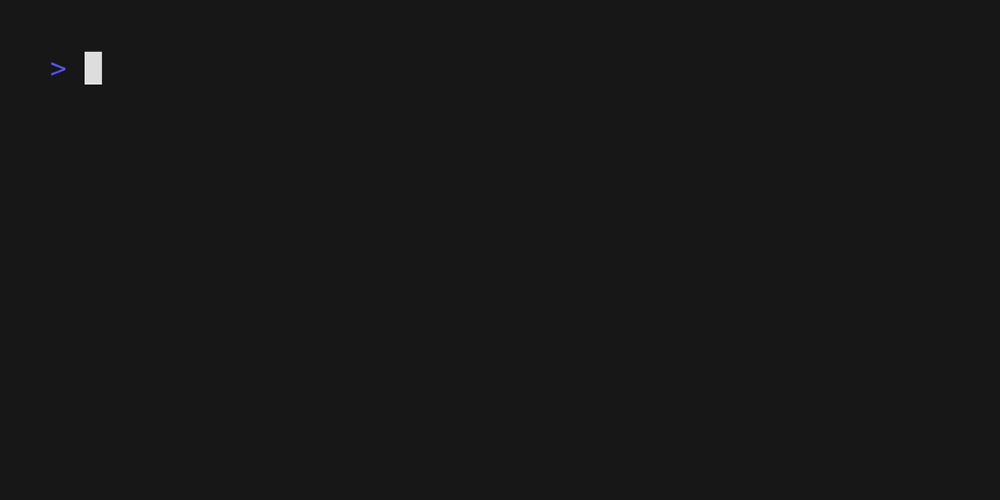

# Bank


**Bank** is a command‑line utility that combines the behavior of `mkdir` and
`touch`. It creates directories or empty files, automatically creates parent
paths, manages permissions, and prompts when a path is ambiguous.



## ✨ Features

- **Smart detection** – decides automatically whether a path is a file or a
  directory.
- **Parent creation** – creates missing parent directories with `-p`.
- **Permission control** – sets permissions with `-m`.
- **Interactive mode** – asks for clarification on ambiguous paths with
  `-i`.
- **Touch functionality** – updates timestamps of existing files.
- **Verbose output** – provides detailed feedback with `-v`.
- **Multi‑path support** – handles several files and directories in one
  command.
- **Custom timestamps** – sets dates/times with `--date`, `-t`, or `-r`.
- **No‑create mode** – updates timestamps only, using `-c`.
- **Fine‑grained control** – separate access/modification time flags
  `-a`/`--mtime`.
- **Symlink support** – works with symbolic links via `--no-dereference`.

## 🚀 Installation

From the workspace root:

```bash
cargo build --release -p bank
# Binary is placed at ./target/release/bank
```

## 📖 Usage

```bash
bank [OPTIONS] <PATH>...
```

**Note:** Multiple paths are supported; you can create several files and/or
directories in a single invocation.

### Options

#### Creation control

- `-d, --directory` – force directory creation (mkdir mode).
- `-f, --file` – force file creation (touch mode).
- `-p, --parents` – create missing parent directories.
- `-m, --mode <MODE>` – set permissions in octal (e.g., `755`).
- `-i, --interactive` – prompt for ambiguous paths.

#### Timestamp control

- `-c, --no-create` – update timestamps only; do not create files.
- `--date <STRING>` – parse a date string instead of using the current time.
- `-t, --timestamp <STAMP>` – use `[[CC]YY]MMDDhhmm[.ss]` format.
- `-r, --reference <FILE>` – copy timestamps from another file.
- `-a, --atime` – modify only the access time.
- `--mtime` – modify only the modification time.
- `--no-dereference` – affect symbolic links rather than their targets.

#### General

- `-v, --verbose` – enable verbose output.
- `-h, --help` – display help information.
- `-V, --version` – display version information.

## 💡 Examples

### Create a file

```bash
# Detected by extension
bank myfile.txt

# Force file creation
bank -f myfile

# Create with specific permissions
bank -m 755 executable_script.sh
```

### Create a directory

```bash
# Detected by trailing slash
bank mydir/

# Force directory creation
bank -d mydir

# Create with parent directories
bank -p deep/nested/directory/
```

### Advanced usage

```bash
# Interactive mode for ambiguous paths
bank -i ambiguous_name

# Verbose output with parent creation
bank -v -p deep/path/to/file.txt

# Directory with custom permissions
bank -d -m 755 -v my_executable_dir

# Multiple files at once
bank file1.txt file2.txt file3.txt

# Multiple directories
bank -d dir1 dir2 dir3

# Mixed file and directory creation
bank config.json scripts/ data.txt logs/

# Bulk creation with parents
bank -p src/components/Button.tsx src/utils/helpers.js \
    tests/unit/button.test.js
```

### Timestamp control

```bash
# Custom date
bank --date "2023-12-25 15:30:00" holiday_log.txt

# Timestamp format
bank -t 202312251530 timestamp_file.txt

# Copy timestamps from another file
bank -r template.txt new_file.txt

# Update timestamps without creating (touch mode)
bank -c existing_file.txt

# Update only access time
bank -a --date "2024-01-01 10:00:00" access_test.txt

# Update only modification time
bank --mtime --date "2024-01-01 10:00:00" mod_test.txt

# Handle symbolic links
bank --no-dereference symlink_target

# Combine custom time and permissions
bank --date "2024-06-15 14:30:00" -m 755 script.sh
```

## 🔍 Smart Detection Rules

When neither `-f` nor `-d` is supplied, Bank applies the following heuristics:

1. Explicit flags (`-f` or `-d`) take precedence.
2. Existing paths retain their original type.
3. Paths with an extension are treated as files.
4. Paths ending with `/` are treated as directories.
5. In interactive mode, the user is prompted for ambiguous cases.
6. All remaining ambiguous paths default to files.

## 🧪 Testing

```bash
cargo test -p bank
```

The test suite covers:

- File and directory creation.
- Smart type detection.
- Permission handling.
- Error conditions.
- Multi‑argument processing.
- Mixed file/directory creation.
- Custom timestamp parsing and setting.
- No‑create mode.
- Access/modification time control.
- Reference‑file timestamp copying.
- Argument validation and conflict detection.

## 🏗️ Architecture

- **CLI parsing** – `clap` handles arguments and multi‑path support.
- **Type detection** – heuristics decide file vs. directory.
- **Batch processing** – efficient handling of many paths.
- **File operations** – cross‑platform creation logic.
- **Permission management** – Unix‑style permission handling.
- **Timestamp control** – uses `chrono` for parsing and setting.
- **Reference support** – copies timestamps from another file.
- **Time granularity** – separate access and modification controls.
- **Interactive UI** – `dialoguer` provides prompts.
- **Error handling** – `anyhow` supplies context‑rich errors.
- **Symlink awareness** – correct handling of symbolic links.

## 🤝 Contributing

Contributions are welcome. The project follows the same development practices as
the rest of the npxr workspace.

## 📄 License

Licensed under the MIT License. See the [LICENSE](LICENSE) file for details.
